# Activity Diagram Guideline — SWD392 Group 5

This is a **standalone instruction** for the Project Management System report. An author or AI agent needs only this guideline and the supplied `Iter1_Group05_BinhNA_TrungNT_KhanhNQ_LuanTC.docx` to draw an Activity Diagram. Do not require any other project file, existing diagram, or separate template.

## 1. Read the Use Case before drawing

- Open the supplied Word file **read-only**. For each requested concrete UC, locate its **UC ID and name**, Primary Actor, Trigger, Preconditions, Normal Flow, Alternative Flows, Exceptions, Postconditions, and Business Rules. A numbered child UC (for example `UC-09.2`) gets its own diagram; do not replace it with a diagram for an abstract `Manage ...` parent.
- The **Word UC Specification is the source of behavior**. Use its actual steps and conditions; do not copy a flow from another diagram, add implementation details, or invent an error path. Preconditions normally describe the starting state, not extra activities such as `Log In`.
- If a referenced rule is not defined in the supplied Word file, or a required step/branch is ambiguous or contradictory, **stop that UC and ask for clarification**. Do not use an unseen source to fill the gap. Continue with other unambiguous UCs if drawing several.
- In the editable source, put a short comment before each action/branch identifying the corresponding Word step or flow (for example `NF4`, `AF-01.2`, `EX-01`, `POST2`). These trace comments are not visible in the diagram. Do **not** display step numbers inside action nodes.

## 2. Common visual format

| Element | Required appearance |
|---|---|
| Layout | Portrait; main flow top to bottom; white background |
| Font | Times New Roman throughout; lane headings **18**, actions **16**, decision text **15**, guard labels **14** in PlantUML font-size units |
| Swimlanes | Primary actor on the left, `System` next, then an external participant only if the UC uses one; label the actor lane with the role stated in Word |
| Nodes | Initial = filled circle; action = light-gray rounded rectangle; decision/merge = white diamond; Activity Final = bullseye |
| Branches | A short question at a decision; meaningful, mutually exclusive guards in `[square brackets]` on its outgoing arrows |
| Concurrency | Fork/join bars only when the Word UC actually has parallel work; a merge, not a fork/join, reunites alternative paths |
| Lines | Dark gray `#202020`, consistent width, open arrowheads; no dangling paths, crossing text, or overlapping guards |
| Frame | Complete outer border on **all four sides**, vertical lane dividers, and a horizontal line below the lane headings |
| Wording | Concise sentence-case **verb + object** actions; wrap long labels; no explanatory paragraphs in nodes |
| Title | No title, caption, note, or legend inside the diagram; place the report caption below the exported image |

Use only lanes needed for that UC. Common role labels are `Guest`, `Staff`, `Project Member`, `Project Owner`, `Product Owner`, `Developer`, `System Administrator`, and `System`; an external service may have its own lane if it acts in the Word flow. Do not make lanes for a database, UI, data store, or internal module. Use one Initial Node by team convention. Every completed path must reach a clear ending; multiple Activity Finals are allowed for distinct outcomes. A correction-and-resubmission path must perform its relevant validation again before testing the new result.

The final diagram must remain readable when fitted into approximately **16.5 × 20.5 cm** in the report. Keep labels away from borders and connectors. If an SVG renderer omits the frame, lane-header line, or open arrowheads, finish the **exported SVG** with matching dark vector strokes (`#202020`, approximately 1.4 px), leaving at least 10 px of clear space around the content. Check all four border sides after export. Keep the `.puml` as the editable flow source and repeat the same finishing step after each re-render.

## 3. Self-contained PlantUML starter

Copy this starter into a new `.puml` file. **Replace every placeholder** using the selected Word UC; keep only lanes, actions, decisions, and endings supported by that UC. The starter's two sample actions are syntax placeholders, not required business steps.

```plantuml
@startuml
' UC: <UC ID> - <Use Case Name>
' Source: Iter1_Group05_BinhNA_TrungNT_KhanhNQ_LuanTC.docx
!pragma useVerticalIf on
skinparam backgroundColor #FFFFFF
skinparam shadowing false
skinparam defaultFontName "Times New Roman"
skinparam defaultFontSize 16
skinparam defaultTextAlignment left
skinparam roundCorner 18
skinparam ArrowColor #202020
skinparam ArrowThickness 1.4
skinparam ArrowFontName "Times New Roman"
skinparam ArrowFontSize 14
skinparam ArrowFontColor #111111
skinparam conditionStyle diamond
skinparam ConditionEndStyle diamond
skinparam activity {
  BackgroundColor #F7F7F7
  BorderColor #202020
  BorderThickness 1.2
  FontColor #111111
  FontName "Times New Roman"
  FontSize 16
  StartColor #111111
  EndColor #111111
  BarColor #111111
  DiamondBackgroundColor #FFFFFF
  DiamondBorderColor #202020
  DiamondFontName "Times New Roman"
  DiamondFontSize 15
}
skinparam swimlane {
  BorderColor #202020
  BorderThickness 1.4
  TitleBackgroundColor #FFFFFF
  TitleFontColor #111111
  TitleFontName "Times New Roman"
  TitleFontSize 18
  TitleFontStyle bold
}
!function $lane_title($title)
!return $title + "\n<size:7><U+00A0></size>"
!endfunction
|ACTOR| $lane_title("Primary Actor")
|SYS| $lane_title("System")
|ACTOR|
start
' [NF1] Replace with an actual Word UC step.
:Replace with actor action;
|SYS|
' [NF2] Replace with an actual Word UC step.
:Replace with system action;
stop
@enduml
```

Replace `Primary Actor` and both example actions. For a decision, use PlantUML `if (...) then ([guard]) ... else ([guard]) ... endif`; for a retry, show the return to input/validation and label both the retry and exit guards. Render with an available PlantUML renderer (for example `java -jar plantuml.jar -tsvg <file>.puml`). If the renderer is unavailable, report that limitation rather than providing an unverified export.

## 4. Deliverables and final check

- Save an editable `.puml` and matching `.svg` for each UC, using the **ID and English name in Word**: for example `UC-09.2-add-project-member.puml` and `UC-09.2-add-project-member.svg`. Keep the pair together in an output folder chosen for the task. PNG is optional for preview only.
- Open the actual SVG, not just the source code. Verify that every Word Normal/Alternative/Exception Flow appears where applicable, no unsupported action appears, every decision guard is legible, every path is connected, and the font, symbols, lane labels, and **full frame** match section 2.
- Report caption, outside the SVG: `Figure <number>. <Use Case Name> Activity Diagram (<UC ID>)`.

**Behavior comes from the supplied Iter1 Word file; presentation comes from this guideline.** Do not edit the Word file while producing diagrams.
